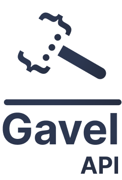

## Description
Gavel API is designed to simplify the management of detained goods and auctions in Tunisian ports. It provides a secure, efficient, and user-friendly solution for customs officers, buyers, and businesses alike.
## Features
+ Comprehensive Goods Management: Add, update, and delete detained goods with detailed information.
+ Secure Auction System: Place bids on goods, view bid history, and manage your bids with role-based access control.
+ User Authentication and Role Management: Secure user signup, login, and role-based access.
+ Real-Time Updates: Stay informed with real-time updates on goods status, bid values, and auction outcomes.
+ Automated Winner Assignment: Automatically assigns auction winners based on the highest bid.
## Installation
1. Clone the repository:

```bash
https://github.com/elaxolotl/Gavel
cd gavel
```
2. Create a virtual environment and activate it:

```bash
python -m venv venv
venv\Scripts\activate
```

3. Install the dependencies:
```bash
pip install -r requirements.txt
```

4. Set up the database:
```bash
flask db upgrade
```

5. Run the app:
```bash
flask run
```

## Endpoints

### Goods
- **POST ```/goods```**: Add a new detained good.
- **GET ```/goods```**: Get all detained goods.
- **GET ```/goods/<int:good_id>```**: Get a specific detained good.
- **PUT ```/goods/<int:good_id>```**: Update a detained good.
- **DELETE ```/goods/<int:good_id>```**: Delete a detained good.

### Auctions
- **POST ```/goods/<int:good_id>/auction```**: Place a new auction.
- **GET ```/auctions/<int:auction_id>```**: Get a specific auction.
- **PUT ```/auctions/<int:auction_id>```**: Update an auction.
- **DELETE ```/auctions/<int:auction_id>```**: Delete an auction.

### Bids
- **POST ```/auctions/<int:auction_id>/bids```**: Place a bid in an auction.
- **GET ```/auctions/<int:auction_id>/bids```**: Get all bids for a specific auction.
- **GET ```/bids/<int:bid_id>```**: Get a specific bid.
- **DELETE ```/bids/<int:bid_id>```**: Delete a bid.

### Users
- **POST ```/signup```**: Signup a new user.
- **POST ```/login```**: Login a user.
- **GET ```/user```**: Get the current logged-in user.
- **POST ```/logout```**: Logout the current user.

## Configuration

The application can be configured using environment variables. The main configuration file is `config.py`.

## Contributing

Contributions are welcome! Please follow these steps:

1. Fork the repository.
2. Create a new branch (`git checkout -b feature-branch`).
3. Make your changes.
4. Commit your changes (`git commit -m 'Add some feature'`).
5. Push to the branch (`git push origin feature-branch`).
6. Open a pull request.

## License

This project is licensed under the MIT License.

## Contact

For any questions or inquiries, please contact the project maintainers at [youssefechadysfaxi@gmail.com].
You can also find a detailed project report [here](web_services_report.pdf).


